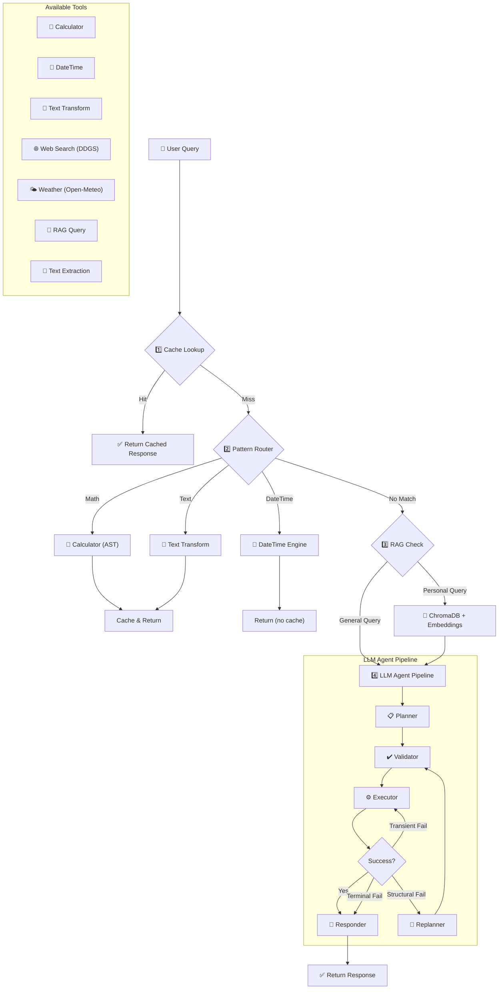

# 🤖 AI Agent Engine

Autonomous AI agent with deterministic routing, RAG-powered personalization, and multi-layer optimization.

Built from scratch in pure Python to demonstrate full control over planning, execution, recovery, and LLM usage.

---

## 🧠 Core Principle

Most agents send every query to the LLM.

This system avoids that.

```
Query → Cache → Pattern Router → RAG Knowledge Base → LLM (only if required)
```

Deterministic queries are executed locally.
Personal context is retrieved from knowledge base.
The LLM is used only when reasoning is necessary.

---

## 🚀 What Makes It Strong

### 1. Deterministic Execution Layer (0 LLM Calls)

* Math evaluation via safe Python AST
* Date & time reasoning
* Text transformations (regex + tools)
* Web search via `duckduckgo-search` (DDGS)
* Weather data via Open-Meteo

Local execution is prioritized over model inference.

---

### 2. RAG-Powered Personalization (NEW)

* Personal knowledge base (ChromaDB + SentenceTransformer)
* Context-aware scheduling recommendations
* User preferences, routines, and energy patterns
* Fast semantic search (~30ms after model load)
* No external API calls for personal context

Knowledge base is queried before LLM invocation.

---

### 3. Cost-Aware Design

* Token tracking per session
* Daily API quota enforcement
* Progressive usage warnings (50%, 80%, 100%)
* Disk-based usage logs
* Smart caching (skips dynamic queries like weather, datetime, RAG)

Cost visibility is built into the architecture.

---

### 4. Agent Pipeline (LLM Fallback Layer)

When routing fails:
```
Planner → Validator → Executor → Responder
```

* Structured task decomposition
* Tool validation
* Sequential execution with state tracking
* Automatic retry on transient errors
* Replanning on structural failures

The system is defensive by design.
---


## 💡 Example

```
You: What's 5 + 3?
Agent: 8
⚡ Pattern match — 0 API calls

You: Convert 'hello' to uppercase
Agent: HELLO
⚡ Pattern match — 0 API calls

You: When is my best focus time?
Agent: Morning Peak: 6:00-13:00 (best focus time)...
✗ LLM pipeline triggered

You: What's the weather in Tokyo?
Agent: Current weather in Tokyo is 15°C...
✗ LLM pipeline triggered
```

---

## 📊 Runtime Output Example

```
💰 Session Usage
Prompt tokens: 6,241
Completion tokens: 171
Total tokens: 6,412
Estimated cost: $0.000481

📈 Session Stats
Total queries: 5
Cache hits: 2
Pattern matches: 2
LLM executions: 1
```

---

## 🏗 Architecture Overview

### System Flow



### Project Structure

```
agent_engine/
├── app/                  # System config, tool runner
│   ├── config.py         # Centralized configuration & limits
│   └── runner.py         # Tool execution with retries & timeouts
├── core/                 # Agent brain
│   ├── agent.py          # Main orchestrator
│   ├── planner.py        # LLM-based plan generation
│   ├── planner_validator.py  # Plan validation (570 lines of rules)
│   ├── executor.py       # Sequential step execution
│   ├── responder.py      # Response generation
│   ├── replanner.py      # Failure recovery & replanning
│   ├── failure_classifier.py  # Transient / Structural / Terminal
│   ├── memory.py         # Cache + Session management
│   ├── state.py          # Dependency resolution
│   └── routing/          # Deterministic pattern matchers
│       ├── math_pattern.py
│       ├── datetime_pattern.py
│       └── text_pattern.py
├── tools/                # Tool implementations
│   ├── math/             # Safe AST-based calculator
│   ├── time/             # DateTime operations
│   ├── text/             # Text transforms & extraction
│   ├── web/              # Web search & weather
│   ├── rag/              # ChromaDB knowledge base
│   ├── llm/              # LLM client
│   ├── registry.py       # Tool registry
│   └── schemas.py        # Pydantic schemas for all tools
├── infra/                # Infrastructure
│   ├── logger.py         # Structured logging system
│   ├── env.py            # Environment variable loading
│   └── ui.py             # CLI display helpers
├── prompts/              # LLM prompt templates
├── rag_data/preferences/ # User knowledge base (markdown)
├── runtime/              # Logs, cache, telemetry, ChromaDB
├── tests/                # Pattern matcher tests
└── main.py               # CLI entry point
```

---

## 🛠 Tech Stack

* Python 3.11+
* Gemini API (LLM layer)
* ChromaDB (vector database)
* SentenceTransformer (embeddings)
* LangChain Text Splitters (chunking)
* Open-Meteo (weather data)
* DuckDuckGo Search via DDGS
* Local AST parsing for safe math evaluation

---

## 🎯 What This Demonstrates

* Multi-layer agent optimization (cache → patterns → RAG → LLM)
* RAG integration for personalized context
* Deterministic routing before LLM invocation
* Cost-aware AI architecture
* Failure recovery strategies
* Structured logging & telemetry
* Clean modular system design

---

## 🚀 Setup

```bash
git clone https://github.com/harshbhanushali26/ai-agent-engine.git
cd ai-agent-engine
pip install -r requirements.txt

# Configure API
cp .env.example .env
# Add GEMINI_API_KEY

# Load RAG knowledge base
python -m tools.rag.loader

# Run agent
python main.py
```


---

## 📝 Adding Personal Preferences

Edit `rag_data/preferences/user_prefs.md` with your:
- Daily routines
- Energy patterns
- Scheduling preferences
- Protected time slots

Then reload:
```bash
python -m tools.rag.loader
```


---

## 🛣️ Roadmap

* [x] Pattern matching (math, datetime, text)
* [x] RAG integration for personal context
* [x] Token tracking & cost estimation
* [ ] Async tool execution
* [ ] REST API layer
* [ ] Streaming responses
* [ ] Multi-agent collaboration

---

## 📝 License

MIT

---

## 👤 Author

Harsh Bhanushali
GitHub: [https://github.com/harshbhanushali26](https://github.com/harshbhanushali26)

---


